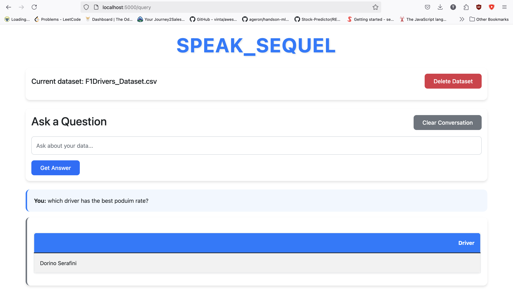

# SPEAK_SEQUEL: Natural Language SQL Query Generator 🗣️



## Overview 🎯

SPEAK_SEQUEL transforms how you interact with your data. Simply ask questions in plain English, and get **SQL-powered answers instantly**. No need to write complex SQL queries—just **talk to your database**.

### Example:

Instead of writing:
```sql
SELECT player_name, COUNT(*) as games 
FROM dataset 
WHERE score > 50 
GROUP BY player_name 
ORDER BY games DESC 
LIMIT 5;
```

Just ask:
> "Who are the top 5 players that scored more than 50 points?"

---

## Features ⭐

✅ **CSV File Analysis** – Upload and analyze datasets effortlessly  
✅ **Natural Language Processing** – Convert text-based queries into SQL  
✅ **Automatic SQL Generation** – No SQL expertise needed  
✅ **Interactive UI** – Seamless user experience  
✅ **Conversation History** – Track previous queries  
✅ **Easy Data Management** – View, filter, and refine data dynamically  

---

## Setup Guide 🚀

### Prerequisites

Ensure you have **Python 3.8+** installed. Install dependencies using:

```bash
pip install flask pandas requests markdown2 python-dotenv sqlite3 urllib3
```

### Quick Start

1. **Get API Access**
   - Sign up at [OpenRouter](https://openrouter.ai)
   - Generate an **API key**
   - Create a `.env` file in the project root:
     ```bash
     OPENROUTER_API_KEY=your-api-key-here
     ```

2. **Run the Application**
   ```bash
   python app.py
   ```

3. **Access the Interface**
   - Open your browser
   - Visit: `http://localhost:5000`

---

## Using SPEAK_SEQUEL 📊

1. **Upload Data**
   - Click **"Upload Dataset"**
   - Select a **CSV file**
   - Wait for **confirmation**

2. **Ask Questions**
   Example queries:
   - "Show me the first 5 rows"
   - "What's the average price?"
   - "Who are our top customers?"
   - "How many sales per month?"

3. **Get Results**
   - View **generated SQL**
   - See **formatted query results**
   - Ask **follow-up questions**

---

## Project Structure 📁

```
csv-analyzer/
├── app.py              # Main Flask app
├── gemini_handler.py   # API integration
├── database.py         # Data operations
├── query_executor.py   # SQL execution
├── templates/          # HTML files
├── static/             # CSS & JS assets
├── .env                # API key (not included in repo)
├── requirements.txt    # Dependencies
└── README.md           # Project documentation
```

---

## Troubleshooting 🔧

### Common Issues & Solutions

| Problem            | Solution |
|-------------------|----------|
| **Upload Errors** | Ensure correct CSV format, verify file size, check permissions |
| **Query Issues**  | Be specific, check column names, verify data types |
| **API Problems**  | Validate API key, check internet, monitor rate limits |

---

## Contribution Guide 🤝

We welcome contributions! Here’s how you can help:

📌 **Fork & Star** the repository  
📌 **Submit Issues** for bugs or improvements  
📌 **Create Pull Requests** with well-documented changes  

### Areas for Improvement:
- Support for additional data formats
- Data visualization
- Enhanced UI & visualizations
- More advanced query optimization
- Performance improvements

---

## License 📄

This project is licensed under the **MIT License**. See [LICENSE](LICENSE) for details.

---

## Author ✨

📌 **Created by:** [Subramanya]  
📧 **Contact:** tnsubramanya7@gmail.com
🔗 **GitHub:** [your-github-profile](https://github.com/subramanya-44)  

---

Happy coding! 🚀🔥
